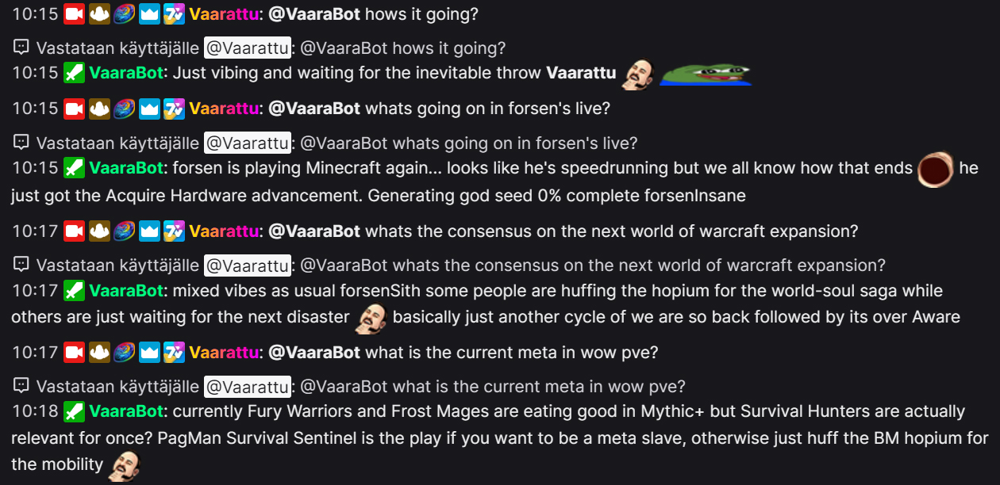

# 🤖 Vaarattu's Twitch AI Chat Bot

A witty Twitch chat bot powered by Google Gemini AI. Responds when mentioned with personality, humor, and style.


 
## ✨ Features

- **🎯 Mention-based** - Responds when pinged with `@botname`
- **💬 Conversation memory** - Remembers last 10 exchanges per user for context
- **🌍 Multi-language** - Detects and responds in the user's language
- **😄 Personality** - Witty, playful, and fun while staying appropriate
- **📺 Multi-channel** - Can join one or more Twitch channels
- **⏱️ Rate limiting** - Per-user cooldown and hourly message limits
- **🔐 OAuth flow** - Automatic token management with refresh support
- **📸 Screenshot capture** - Can capture Twitch stream screenshots with ffmpeg/streamlink
- **🎬 Ad detection** - Automatically detects and waits for pre-roll ads to complete
- **🎙️ Stream transcription** - Optionally transcribes live stream audio locally with faster-whisper
- **🔍 Web search** - Can search the web for current information
- **🌐 Website scraping** - Can scrape and read website content

## 🚀 Setup

### 1. Create a Twitch Application

1. Go to [Twitch Developer Console](https://dev.twitch.tv/console/apps)
2. Click **Register Your Application**
3. Set a name for your bot
4. Add `http://localhost:17563` as an **OAuth Redirect URL**
5. Set category to **Chat Bot**
6. Create and note down your **Client ID** and **Client Secret**

### 2. Get a Gemini API Key

1. Go to [Google AI Studio](https://aistudio.google.com/apikey)
2. Create an API key
3. Copy the key

### 3. Configure Environment

```bash
# Copy the example env file
cp .env.example .env

# Edit .env with your credentials
```

### 4. Install Dependencies

```bash
pip install -r requirements.txt
```

### 5. Run the Bot

```bash
python main.py
```

On first run:

1. The bot tests the Gemini API connection
2. A browser window opens for Twitch OAuth login
3. Authorize the application
4. The bot joins your channel(s) and starts listening

## 💬 Usage

Mention the bot in Twitch chat:

```
@botname what's the meaning of life?
@botname tell me a joke
@botname mikä on paras pizza? (responds in Finnish)
```

## ⚙️ Configuration

| Variable                      | Description                                     | Default           |
| ----------------------------- | ----------------------------------------------- | ----------------- |
| `TWITCH_APP_ID`               | Twitch application Client ID                    | _Required_        |
| `TWITCH_APP_SECRET`           | Twitch application Client Secret                | _Required_        |
| `GEMINI_API_KEY`              | Google Gemini API key                           | _Required_        |
| `TARGET_CHANNELS`             | Channels to join (comma-separated)              | Bot's own channel |
| `USER_TIMEOUT_SECONDS`        | Cooldown between responses per user             | `5`               |
| `MAX_MESSAGES_PER_HOUR`       | Max responses per user per hour (0 = unlimited) | `10`              |
| `AD_DETECTION_ENABLED`        | Enable automatic pre-roll ad detection          | `true`            |
| `AD_DETECTION_CHECK_INTERVAL` | How often to check for ads (seconds)            | `5.0`             |
| `AD_DETECTION_MAX_WAIT`       | Maximum time to wait for ads (seconds)          | `30.0`            |
| `STREAMLINK_OAUTH_TOKEN`      | Streamlink OAuth token for ad-free streams      | _Optional_        |
| `TRANSCRIPTION_ENABLED`       | Enable local stream audio transcription          | `false`           |
| `TRANSCRIPTION_CHANNEL`       | Twitch channel to transcribe                     | First target channel |
| `TRANSCRIPTION_MODEL`         | faster-whisper model name                        | `small`           |
| `TRANSCRIPTION_DEVICE`        | faster-whisper device (`cpu` or `cuda`)          | `cpu`             |
| `TRANSCRIPTION_COMPUTE_TYPE`  | faster-whisper compute type                      | `int8`            |
| `TRANSCRIPTION_LANGUAGE`      | Optional language code; blank or `auto` auto-detects | _Optional_    |
| `TRANSCRIPTION_STREAM_QUALITY` | Stream quality to resolve for audio extraction  | `480p`            |
| `TRANSCRIPTION_CHUNK_SECONDS` | Audio chunk size sent to Whisper                 | `10.0`            |
| `TRANSCRIPTION_OVERLAP_SECONDS` | Overlap between chunks for cleaner boundaries  | `1.0`             |
| `TRANSCRIPTION_CONTEXT_LIMIT` | Recent transcript segments added to chat context | `6`               |
| `TRANSCRIPTION_AUDIO_QUEUE_MAX_SIZE` | Max spooled audio chunks waiting for Whisper | `30`              |
| `TRANSCRIPTION_PAUSE_WHILE_LLM_BUSY` | Defer Whisper while the LLM is responding    | `true`            |
| `INPUT_QUEUE_MAX_SIZE`        | Max queued chat/streamer inputs                  | `20`              |
| `INPUT_QUEUE_MIN_RESPONSE_INTERVAL` | Minimum seconds between bot responses       | `2.0`             |
| `INPUT_QUEUE_MAX_AGE_SECONDS` | Drop queued inputs older than this               | `180.0`           |
| `STREAMER_SPEECH_RESPONSES_ENABLED` | Let streamer speech enqueue bot responses   | `true`            |
| `STREAMER_SPEECH_QUIET_SECONDS` | Quiet gap before streamer speech is finalized  | `4.0`             |
| `STREAMER_SPEECH_MAX_UTTERANCE_SECONDS` | Force-finalize long streamer utterances | `30.0`            |
| `STREAMER_SPEECH_MIN_WORDS`   | Ignore shorter streamer utterances               | `5`               |
| `STREAMER_SPEECH_RESPONSE_COOLDOWN_SECONDS` | Minimum seconds between streamer-triggered queued responses | `90.0` |
| `STREAMER_SPEECH_MAX_PENDING` | Max pending streamer inputs in the queue          | `1`               |
| `GOOGLE_SEARCH_API_KEY`       | Google Custom Search API key                    | _Optional_        |
| `GOOGLE_SEARCH_ENGINE_ID`     | Google Custom Search Engine ID                  | _Optional_        |

### Example `.env`

```env
TWITCH_APP_ID=abc123
TWITCH_APP_SECRET=secret456
GEMINI_API_KEY=AIza...
TARGET_CHANNELS=vaarattu,somechannel
USER_TIMEOUT_SECONDS=5
MAX_MESSAGES_PER_HOUR=10
TRANSCRIPTION_ENABLED=false
TRANSCRIPTION_CHANNEL=vaarattu
```

## 🔧 How It Works

1. **Authentication** - On startup, checks for saved tokens in `tokens.json`. Validates and refreshes automatically, or opens browser for OAuth if needed.

2. **Chat Connection** - Uses TwitchAPI's IRC-based Chat module to connect to configured channels.

3. **Message Handling** - Listens to all messages, responds only when:

   - Bot is mentioned with `@botname`
   - User is not on cooldown
   - User hasn't exceeded hourly limit

4. **AI Response** - Sends messages to Gemini with:

   - Conversation history for context
   - System prompt for personality and rules
   - User's name for personalized responses

5. **Language Detection** - Automatically detects and responds in the user's language.

6. **Ad Detection** - When capturing screenshots:
   - Uses OCR (Tesseract) to detect "Preparing your stream" text
   - Automatically waits up to 30 seconds for pre-roll ads to finish
   - Polls every 5 seconds to check if ads have cleared
   - Falls back gracefully if timeout is reached
   - Can be disabled via `AD_DETECTION_ENABLED=false`

7. **Stream Audio Transcription** - When enabled:
   - Uses Streamlink to resolve the configured Twitch channel
   - Runs FFmpeg as an audio-only pipe (`16 kHz`, mono PCM)
   - Spools short audio chunks, then sends them to local faster-whisper with VAD enabled by default
   - Defers Whisper work while the LLM is generating a response
   - Stores transcript segments separately from chat messages
   - Adds only the most recent transcript segments to LLM context
   - Coalesces streamer speech after a quiet gap before treating it as a bot input
   - Can be controlled by broadcaster/mod commands: `!vaarabot transcribe on`, `off`, and `status`

8. **Unified Input Queue** - Chat mentions and finalized streamer speech share one queue:
   - The bot processes one input at a time
   - Chat mentions are prioritized over streamer speech
   - Streamer speech has a cooldown and max-pending limit to avoid spam
   - Old queued inputs are dropped instead of generating stale replies

Note: Twitch stream audio is usually mixed audio. VAD detects speech, but it cannot reliably separate the streamer from game dialogue, teammates, videos, ads, or other speech unless the stream provides an isolated mic/source.

## 📦 System Requirements

### Required Tools

- **Python 3.8+** - Python runtime
- **FFmpeg** - For screenshot capture ([download](https://ffmpeg.org/download.html))
  - Also required for optional stream audio transcription
- **Tesseract OCR** - For ad text detection ([download](https://github.com/tesseract-ocr/tesseract))
  - Windows: Download installer from [UB Mannheim](https://github.com/UB-Mannheim/tesseract/wiki)
  - macOS: `brew install tesseract`
  - Linux: `sudo apt-get install tesseract-ocr`

### Python Dependencies

All Python packages are listed in `requirements.txt`. Key dependencies:

- `twitchAPI` - Twitch chat connection
- `google-genai` - Gemini AI integration
- `streamlink` - Stream URL extraction
- `faster-whisper` - Local stream audio transcription
- `pytesseract` - OCR for ad detection
- `Pillow` - Image processing

## 📁 Files

| File               | Description                                        |
| ------------------ | -------------------------------------------------- |
| `main.py`          | Main bot code                                      |
| `.env`             | Environment variables (create from `.env.example`) |
| `.env.example`     | Example environment file                           |
| `tokens.json`      | Saved OAuth tokens (auto-generated)                |
| `requirements.txt` | Python dependencies                                |

## 📄 License

See [LICENSE](LICENSE) for details.
